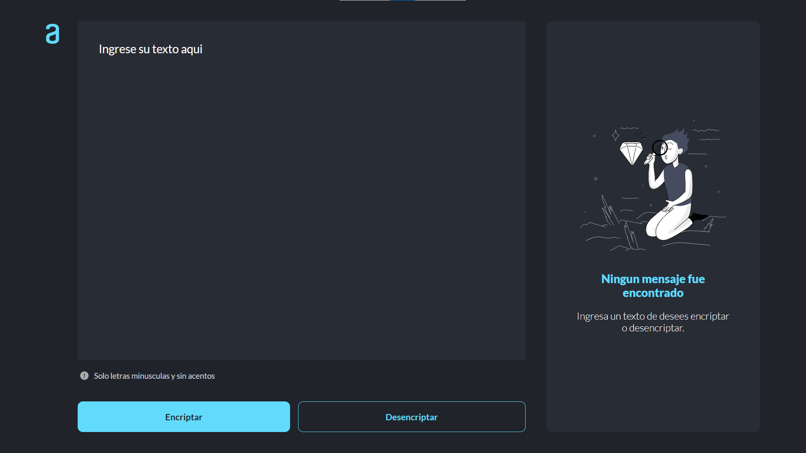
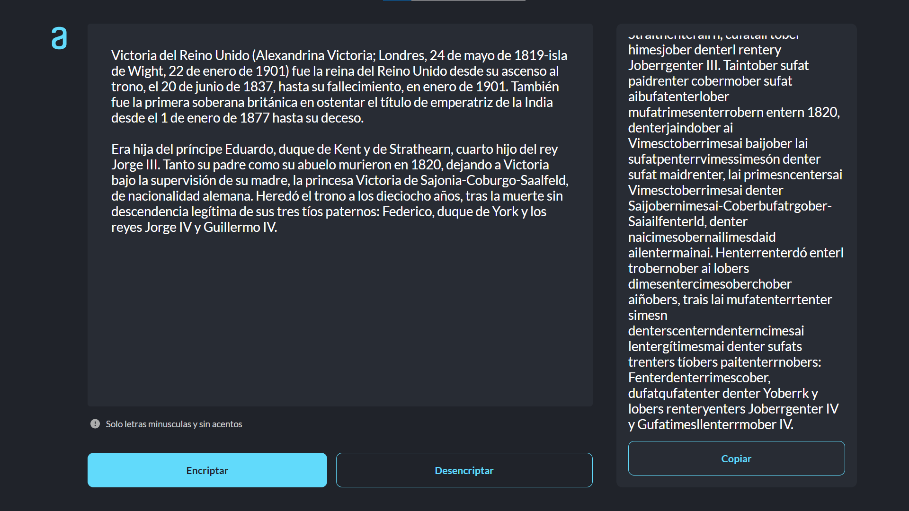
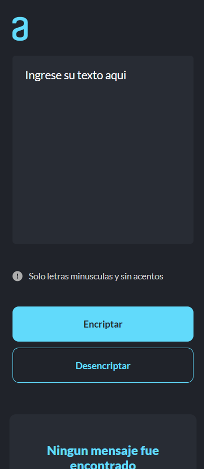
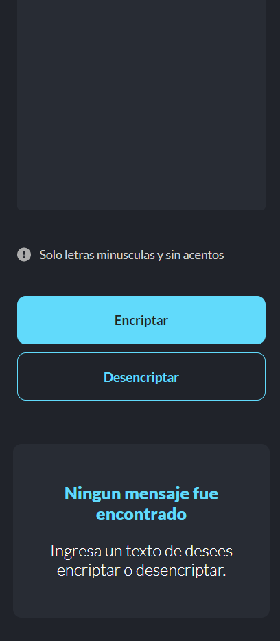
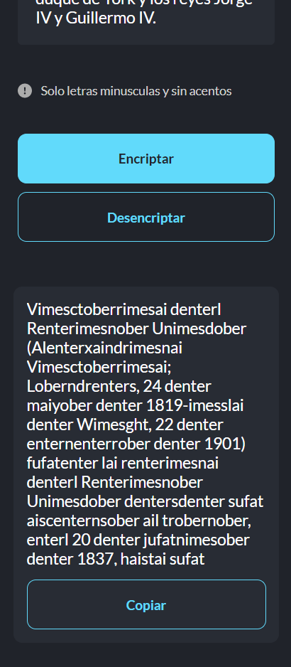

# Text Encryptor

Tool for encrypting and decrypting messages

## Screenshots

- ### Desktop

- ### Mobile

  
  
  

## Technologies

 
 
  &nbsp; &nbsp;

## Website

[View challenge completed](https://jaenfigueroa.github.io/text-encriptor/).

